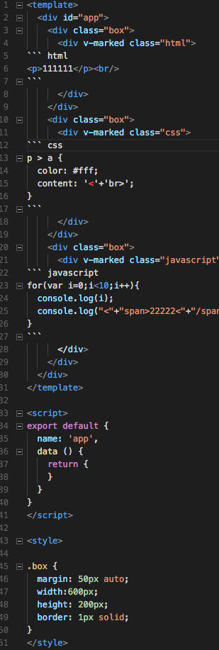
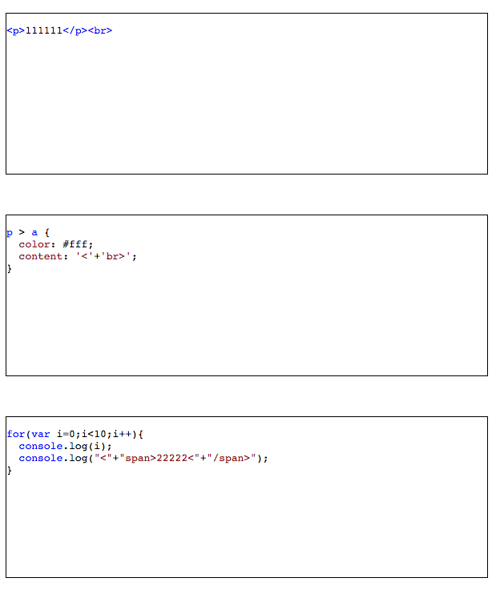

# codeinvue

> write HTML, css, javascript code in vue file directively

## Installation

### NPM

```bash
npm install codeinvue --save
```

## Usage

### main.js
```js
import Vue from 'vue'
import App from './App.vue'
import codeinvue from './lib/codeInVue'

Vue.use(codeinvue);

new Vue({
  el: '#app',
  render: h => h(App)
})
```

### app.vue
```
    <div v-marked class="html">
      <!-- write your markdown syntax html code directively hear -->
    </div>

    <div v-marked class="css">  <-- remember to add classname(css or html or javascript) -->
      <!-- write your markdown syntax hear -->
    </div>

    <div v-marked class="javascript">
      <!-- write your markdown syntax javascript code hear, split the HTML tag string or it will be treated like a HTML tag by browser -->
    </div>
```


### effect
